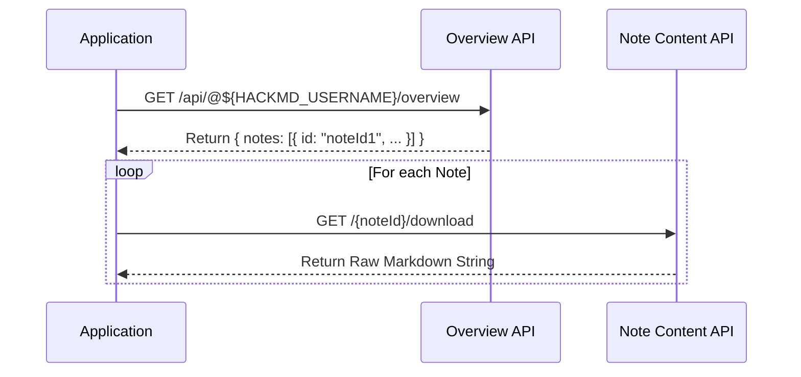

# Data & API Specification

## 1. 資料來源 (Data Source)

本應用程式依賴 HackMD 的兩個公開 API 來獲取內容。

### 1.1 取得文章列表 (Get Article List)
- **Endpoint**: `https://hackmd.io/api/@${HACKMD_USERNAME}/overview`
- **Method**: `GET`
- **Description**: 獲取使用者的所有公開筆記列表。
- **Environment Variable**: `HACKMD_USERNAME` (e.g., `mangosu`)
- **Key Response Fields**:
  - `notes`: Array of note objects.
  - `notes[].id`: Unique Note ID (e.g., `"LspA0caqSoSVX_forIYa9g"`). Required for fetching content.
  - `notes[].shortId`: Short ID (e.g., `"BkClJSyZR"`).
  - `notes[].title`: Article title.
  - `notes[].tags`: Article tags.
  - `notes[].publishedAt`: Publish timestamp.
  - `user`: User profile info.

#### Response Schema (Source)
```typescript
interface HackMDResponse {
  user: HackMDUser;
  notes: HackMDNote[];
  meta: HackMDMeta;
}

interface HackMDNote {
  id: string;           // Used for download endpoint
  title: string;
  tags: string[];
  createdAt: number;
  publishType: 'view' | 'edit' | 'book' | 'slide';
  publishedAt: string | null;
  shortId: string;
  userpath: string;
  viewCount: number;
}
```

### 1.2 取得單篇文章內容 (Get Single Article Content)
- **Endpoint**: `https://hackmd.io/{noteId}/download`
- **Method**: `GET`
- **Response Type**: `string` (Raw Markdown content)
- **Description**: 透過 `noteId` 下載特定筆記的原始 Markdown 內容。
- **Note**: This endpoint returns raw text, not JSON.

### 1.3 呼叫關聯 (API Relationship)


## 2. 應用程式資料模型 (Application Data Model)

### Article
前端使用的核心文章型別，經由轉換 HackMD 資料而來。

```typescript
interface Article {
  id: string;           // 對應 HackMDNote.id
  slug: string;         // 生成格式: {yyyyMMdd}-{kebab-case-title}
  title: string;        // 對應 HackMDNote.title - 注意：可能需要從 raw content 解析 frontmatter
  description: string;  // 從內容擷取前四行或特定摘要
  coverImage?: string;  // 從內容解析出的第一張圖片 URL
  content: string;      // 完整 Markdown 內容 (需額外 fetch)
  tags: string[];       // 對應 HackMDNote.tags
  publishedAt: string;  // ISO Date String
    name: string;
    avatar: string;
  };
  viewCount: number;
}
```

### Slug Generation Strategy
1.  **Date Prefix**: Parse `publishedAt` (or `createdAt` if not published) to `YYYYMMDD`.
2.  **Title Transformation**:
    - Convert to lowercase.
    - Replace spaces and special chars with hyphens.
    - Remove non-alphanumeric chars (keep hyphens).
    - Example: `20240501-css-grid-vs-flexbox`

## 3. 資料獲取介面 (Data Fetching Interface)

### `lib/data.ts` (Planned)

```typescript
// 獲取所有文章列表 (用於首頁、文章列表頁、Sidebar)
export async function getAllArticles(): Promise<Article[]> {
  // 1. Fetch HackMD Overview API
  // 2. Transform HackMDNote[] -> Article[] (without full content)
  // 3. Sort by date desc
}

// 獲取單篇文章內容 (透過 Note ID)
export async function getArticleContent(noteId: string): Promise<string | null> {
  // Fetch full content from `https://hackmd.io/{noteId}/download`
}
  // Fetch full content from `https://hackmd.io/{noteId}/download`
}
```
> [!NOTE]
> **Mapping Logic (Slug vs NoteID)**:
> - **Slug**: 使用於前端路由 (URL)，格式為 `yyyymmdd-title` (由 `Spec.md` 定義)。
> - **NoteID**: 使用於 HackMD API 呼叫，為筆記的唯一識別碼。
> - **Resolution Process**:
>     1. 呼叫 `getAllArticles()` 取得所有文章列表。
>     2. 遍歷列表，針對每篇文章呼叫 `getArticleContent(noteId)` 取得原始資料 (Raw Data)。
>     3. 根據原始資料或 Metadata，套用 `yyyymmdd-title` 規則生成 `slug`。
>     4. 將此 `slug` 用於生成靜態頁面 (`generateStaticParams`) 與路由匹配。

## 4. 內容處理策略 (Content Processing Strategy)

本專案採用 **Pipeline (管線)** 模式處理內容資料，將原始 HackMD Markdown 轉換為可渲染的 HTML。

### 處理流程 (Data Transformation Pipeline)

1.  **資料獲取 (Ingestion)**: 從 HackMD API 下載 Raw Markdown String。
2.  **預處理 (Preprocessing)**: 解析 Frontmatter (YAML) 以提取 Metadata (Title, Date, Tags)。
3.  **渲染轉換 (Rendering)**: 使用 `markdown-it` 將 Markdown 轉為 HTML。
    - **整合解析 (Integration)**: 包含標準 Markdown 與 HackMD 特有語法 (Callouts, Spoiler, Highlight 等)。
    - **詳細實作規範**: 請參閱 [DevGuide.md > Markdown Renderer 解析](./DevGuide.md#6-markdown-renderer-解析)。

## 5. 搜尋策略 (Search Strategy)
搜尋功能採 **Client-Side Filtering (前端篩選)** 方式實作，無需額外 API。

- **Data Source**: 使用 `getAllArticles()` 獲取的完整文章列表 (`Article[]`)。
    - **注意**: `getAllArticles()` 回傳的是已經透過「Slug Resolution Logic」處理過的資料，因此每個物件都已包含正確的 `slug`，可用於路由跳轉。
- **Logic**:
    - **Keyword Match**: 篩選 `title` 或 `description` 包含關鍵字的項目。
    - **Tag Match**: 篩選 `tags` array 中包含選定標籤的項目。
- **Flow**:
    1. 使用者打開 Search Dialog，輸入關鍵字。
    2. 前端過濾 `Article[]` 陣列。
    3. 顯示結果列表。
    4. 使用者點擊結果，透過 `next/link` 導航至 `/articles/${article.slug}`。

## 附錄：架構決策 - Slug 解析策略 (Appendix: Architecture Decision - Slug Resolution Strategy)

### 背景 (Context)
在決定如何將 HackMD 的 NoteID 映射到部落格的 URL Slug 時，我們評估了兩種方案。

### 方案比較 (Options Comparison)

| 特性 | **方案一：基於列表 (List-Based)** | **方案二：基於內容 (Content-Based) - [已選用]** |
| :--- | :--- | :--- |
| **流程** | List API -> 算 Slug -> 查 ID -> 抓內容 | List API -> **下載全部 Content** -> 算 Slug |
| **資料來源** | 僅依賴 HackMD List API 的 Metadata | 依賴實際下載的 Markdown 內容 (可讀取 Frontmatter) |
| **準確度** | 中 (依賴 API 標題) | **高** (內容為準，支援 Frontmatter 自訂 Slug) |
| **Build Time** | 快 (只下載需渲染的頁面) | 慢 (需預先下載所有文章才能建立路由) |
| **API Calls** | 低 | 高 (每次 Build 皆需 N+1 次呼叫) |

### 決策 (Decision)
我們選擇 **方案二 (Content-Based)**。

### 理由 (Rationale)
1.  **正確性 (Correctness)**: 確保所有生成的靜態頁面都有實際內容，避免 Dead Links。
2.  **靈活性 (Flexibility)**: 支援未來在文章 Frontmatter 中自訂 `slug`、`date` 或 `title`，而不受限於 HackMD List API 的限制。
3.  **參考案例 (Reference)**: 此架構與參考專案 (`daily-oops`) 一致，利用本地快取機制來平衡 Build Time 效能問題。
