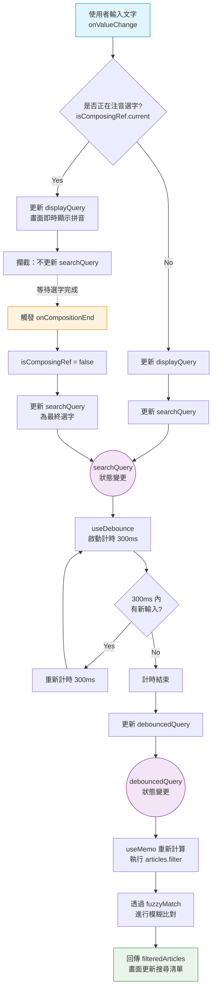

# 開發規範與指南 (Development Guide)

本文件定義專案的開發流程、編碼規範與環境要求，旨在確保團隊協作的一致性與品質。

## 1. 開發環境 (Environment)
- **Runtime**: Node.js v22.22.0+
- **Package Manager**: NPM v10.9.4+
- **Editor**: VS Code (建議安裝 ESLint, Prettier, Tailwind CSS Intellisense 套件)
- **OpenSpec**: v1.1.1 (Verify with `npx openspec --version`)

## 2. Git 工作流 (Git Workflow)
本專案採用簡化的 Feature Branch Workflow。

### Branching Strategy
- `main`: 主分支，隨時保持可部署狀態 (Deployable)。**禁止直接 Commit 到 main**。
- `feature/<name>`: 功能開發分支 (e.g., `feature/sidebar-ui`, `feature/fetch-api`)。
- `fix/<name>`: Bug 修復分支。
- `docs/<name>`: 文件撰寫分支。

### Commit Convention
請遵循 [Conventional Commits](https://www.conventionalcommits.org/) 規範：
- `feat`: 新增功能 (Features)
- `fix`: 修復 Bug (Bug Fixes)
- `docs`: 僅修改文件 (Documentation)
- `style`: 程式碼風格調整 (不影響邏輯)
- `refactor`: 重構 (既非新增功能也非修復 Bug)
- `chore`: 建置過程或輔助工具的變動 (e.g., 修改 .gitignore)

**Example**:
```bash
git commit -m "feat(sidebar): add responsive mobile menu"
```

**Long Commit Message (多行訊息)**:
若訊息內容較長，建議透過檔案進行提交，避免 Shell 換行問題：

1. 建立訊息檔：寫入 `.git_commit_msg`
2. 不可使用 `git add .`！因為會把 `.git_commit_msg` 也加入 commit
3. 執行指令：`git commit -F .git_commit_msg && rm .git_commit_msg`

> **指令詳解**：
> - `git commit -F <file>`: `-F` 代表 File，讓 Git 直接讀取檔案內容作為提交訊息，適合處理多行文字或特殊符號。
> - `&&`: 邏輯 AND，確保 **Commit 成功後** 才會執行刪除指令。若提交失敗，檔案會保留以便修正。
> - `rm <file>`: 刪除暫存的訊息檔，保持目錄整潔。

## 3. 程式碼規範 (Coding Style)
- **TypeScript**: 強型別 (Strict Mode)，避免使用 `any`。
- **Naming**:
  - Components: PascalCase (e.g., `ArticleCard.tsx`)
  - Utilities/Functions: camelCase (e.g., `formatDate.ts`)
  - Constants: UPPER_SNAKE_CASE (e.g., `MAX_RESULTS`)
- **Linting**: 專案已配置 ESLint 與 Prettier，請開啟「存檔自動格式化」(Format On Save)。
- **Tailwind**: 盡量使用 Utility Classes，避免寫自定義 CSS。複雜樣式可使用 `cn()` (clsx + tailwind-merge) 組合。

## 4. 專案目錄結構 (Project Structure)
```
/
├── .openspec/                  # 專案規格文件
│   ├── Spec.md                 # 產品總論與需求大綱
│   ├── DataSpec.md             # 資料結構與 API 規格
│   ├── ComponentSpec.md        # UI 元件與頁面規格
│   ├── DevGuide.md             # 開發規範與環境指南
│   └── Tasks.md                # 專案任務與進度追蹤
├── src/
│   ├── app/                    # Next.js App Router 頁面與佈局
│   │   ├── page.tsx            # 首頁 (最新與熱門文章)
│   │   ├── layout.tsx          # 全域根佈局 (字體)
│   │   ├── globals.css         # 全域 CSS
│   │   ├── about/              # 關於我頁面
│   │   │   └── page.tsx
│   │   └── articles/           # 文章相關路由
│   │       ├── page.tsx        # 所有文章列表
│   │       └── [slug]/         # 文章詳情頁 (動態路由)
│   │           └── page.tsx
│   ├── components/             # 共用 React 元件
│   │   ├── article-card.tsx    # 文章卡片組件 (包含 Read More 連結)
│   │   ├── logo-block.tsx      # 側邊欄 Logo 區塊
│   │   ├── main-layout.tsx     # 主佈局 (導覽列與側邊欄邏輯)
│   │   ├── search-dialog.tsx   # 文章搜尋對話框
│   │   ├── sidebar-nav.tsx     # 側邊欄導覽選單
│   │   └── ui/                 # ShadCN UI 底層元件 (原子組件)
│   │       ├── button.tsx
│   │       ├── card.tsx
│   │       └── ... (其他 UI 組件)
│   ├── hooks/                  # 自定義 React Hooks
│   │   └── use-mobile.tsx      # 偵測行動裝置狀態
│   ├── lib/                    # 工具函式與資料獲取
│   │   ├── data.ts             # 靜態文章資料與獲取邏輯
│   │   ├── markdown-renderer.tsx # Markdown 渲染元件
│   │   └── hackmd-parser/      # HackMD 語法解析器
│   │       ├── styles.css      # 所支援的語法樣式
│   │       ├── index.ts        # 統一匯出點
│   │       ├── hackmd-highlight.ts
│   │       └── hackmd-callout.ts
└── ...config files (tailwind.config.ts, next.config.mjs, etc.)
```

## 5. 設計規範 (Design System)
- **Typography**: Inter (Google Fonts)
- **Colors**: 遵循 `tailwind.config.ts` 中的 ShadCN UI 變數 (CSS Variables)。
- **Dark Mode**: 支援系統切換，實作於 `next-themes`。

## 6. Markdown Renderer 解析
由於 HackMD 語法繁多且可能隨時新增，我們採用 **模組化 Parser** 策略，將 HackMD 語法拆分為獨立的解析函式。

**結構**：
│   ├── lib/                    # 工具函式與資料獲取
│   │   ├── ...
│   │   ├── markdown-renderer.tsx # Markdown 渲染元件
│   │   └── hackmd-parser/      # HackMD 語法解析器
│   │       ├── styles.css      # 所支援的語法樣式
│   │       ├── index.ts        # 統一匯出點
│   │       ├── ...
│   │       ├── hackmd-highlight.ts
│   │       └── hackmd-callout.ts
- 規範：
    - `styles.css` 統一寫入所支援的 HackMD 語法樣式
      - 該樣式只限定在單篇文章頁面，故透過 `src/app/articles/[slug]/layout.tsx` 中的 `ArticleLayout` 匯入樣式
      - 使用 Tailwind v4 的 `@reference` 來存取全域主題變量，避免重複
    - `index.ts` 統一匯出 `HackmdParser` 物件供 `MarkdownRenderer` 使用
    - 解析 HackMD 語法 (Plugins)
      - highlight
          - 語法開頭 `==`
          - 語法結尾 `==`
          - format to html=`<mark></mark>`
      - callout section: info, success, warning, danger
          - 語法開頭 `:::info`
          - 語法結尾 `:::`
          - format to html=`<div class='callout callout-info'></div>`
      - callout section: sopiler
          - 語法開頭 `:::sopiler callout_title`
          - 語法結尾 `:::`
          - format to collapse html=`<details><summary>{callout_title}</summary></details>`

## 7. 搜尋功能設計 (Search Implementation)
由前端實作文章過濾跟搜尋，流程如下：

**狀態流程圖 (State Flow Diagram)：**


1. 手動過濾文章：
    - 停用 `cmdk` 原生的 filter 過濾 (`shouldFilter={false}`)，改爲手動控制過濾結果。
      原因：
      由於 `cmdk` 的 `<Command>` 原生會直接監聽 `<CommandInput>` 的輸入值，
      並即時執行 filter 過濾。與 Debounce 需求衝突。
    - 實作：
      - 使用 `useState` 儲存搜尋關鍵字。
      - 使用 `onCompositionStart`/`End` 偵測 IME 輸入狀態。
      - 使用 `useDebounce` 延遲過濾運算。
      - 使用 `fuzzyMatch` 進行模糊搜尋。

2. 處理注音輸入法 (IME Support)：
   - 避免在選字過程中即觸發 `useDebounce` 執行 filter 過濾。
   - 實作：
     - `onCompositionStart`/`End` Events 監聽 & 
      `useRef (isComposingRef)` 同步更新注音選字狀態
      - 使用 `onCompositionStart` 鎖定 `searchQuery` 更新。
      - 直到 `onCompositionEnd` (選字完成) 才解除鎖定並更新 `searchQuery`，觸發 `useDebounce`。

3. 防抖動 (Debounce)：
   - 「搜尋輸入完整」後，延遲 300ms 才更新 `debouncedQuery`。
	 - Create hook `useDebounce`

4. 模糊搜尋 (Fuzzy Match)：
    - 實作簡易的 Subsequence Matching (子序列比對)，達到跳字匹配的效果，例如輸入 "react" 可匹配 "R...e...a...c...t"。

### React 效能優化 (Performance Optimization)

1. `useCallback` (`handleSelect`)
```typescript
	const router = useRouter()
	const handleSelect = React.useCallback(
		(slug: string) => {
			setOpen(false)
			router.push(`/articles/${slug}`)
		},
		[router]
	)

	return (
		<>
			//...
				<CommandList>
					<CommandEmpty>No results found.</CommandEmpty>
					<CommandGroup heading="Articles">
						{filteredArticles.map((article) => (
							<CommandItem
								key={article.id}
								value={article.slug}
								onSelect={handleSelect}
							>
								<Search className="mr-2 h-4 w-4" />
								<span>{article.title}</span>
							</CommandItem>
						))}
					</CommandGroup>
				</CommandList>
			</CommandDialog>
		</>
	)
```
- 用途：記住緩存 (Memoize) 此函式，提升打字時的效能。

為什麼用 useCallback？
- 避免不必要的渲染：
每次打字會使得整個 `SearchDialog` 元件重新渲染 (Re-render)，如果 `handleSelect` 函式沒有加上 `useCallback`，則每次 `SearchDialog` 元件重新渲染時都會在記憶體中創造一個全新的 `handleSelect` 函式，導致 `CommandItem` 元件認為父元件傳遞新函式給我，進而造成 `CommandItem` 元件重新渲染 (Re-render)。
假設文章有上百篇，則會造成`CommandItem` 元件上百次的重新渲染。
加上 `useCallback` 後，除非 `router` 發生變化，否則不管打字幾次或 `SearchDialog` 元件重新渲染幾次，`handleSelect` 函式都會是同一個記憶體位址，因此 `CommandItem` 元件不會重新渲染。

2. `useRef` (`isComposingRef`)
```typescript
const isComposingRef = React.useRef(false)
```
- 用途：
追蹤「是否正在使用輸入法 (IME, 如注音/拼音) 選字中」。

為什麼用 useRef 而不是 useState？
- 即時性 (Synchronous Access)：
  - 在 onValueChange 事件處理函式中，我們需要 瞬間 知道 isComposingRef.current 的值。
  - useState 的更新是非同步的 (Asynchronous)，如果在同一個 Event Loop 內連續觸發事件，State 可能還沒更新，導致邏輯判斷錯誤。useRef.current 的變更則是同步且立即生效的。
- 避免不必要的渲染：
  - 輸入法選字過程中的 compositionStart / compositionEnd 狀態變化，不需要觸發 UI 畫面的重新渲染 (Re-render)。我們只關心這個狀態來決定「要不要更新 searchQuery」，而非讓畫面有變化。
  - 若使用 useState，每次切換輸入法狀態都會導致元件重新渲染，這是不必要的效能開銷。

3. `useMemo` (filteredArticles)
```typescript
const filteredArticles = React.useMemo(() => {
	return articles.filter(article => fuzzyMatch(article.title, debouncedQuery))
}, [articles, debouncedQuery])
```
- 用途：
緩存 (Cache) 過濾後的文章列表結果。

為什麼用 useMemo？
- 效能優化 (Performance Optimization)：
  - articles.filter(...) 遍歷所有文章並執行 fuzzyMatch 字串比對，這是一個相對昂貴的運算。
  - 如果沒有 useMemo，每次 Component 渲染 (例如 inputValue 打字更新顯示時)，都會重新執行一次 filter 運算，即使搜尋關鍵字根本沒變。
  - 使用 useMemo 後，只有當依賴項目 [articles, debouncedQuery] 改變時，才會重新計算。
- 搭配 Debounce：
  - 我們的 debouncedQuery 是每 300ms 才更新一次。
  - 這意味著，使用者快速打字時 (例如 100ms 輸入一個字)，雖然 SearchDialog 會一直渲染 (因為 inputValue 變了)，但 filteredArticles 不會 重新計算，直到使用者停下來 300ms 後 debouncedQuery 改變，才會執行過濾。這大幅提升了 UI 的流暢度。
