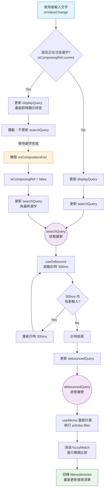

# 開發日誌與架構決策 (DevLog & Architecture Decisions)
記錄在開發過程中較為複雜的技術實作細節、效能優化以及核心架構決策，以供了解「為什麼這麼做」。注意：紀錄日期的排序由新到舊。

## 2026-02-26. next.config.ts 設定 trailingSlash: true
**起因**：
開啟網址 https://su-ya.github.io/mango-db/articles 畫面雖正常，
但在 chrome 的 devtool 中 console 出現 error msg
```
aa5f1c63703743c8.js:1  
HEAD https://su-ya.github.io/mango-db/articles/20260209-ai-產-blog 404 (Not Found)
```

**錯誤原因**：
當網頁滑動讓其他文章的連結（例如 20260209-ai-產-blog）出現進入螢幕視窗時，
Next.js <Link> 元件的預設行為會發出一個背景請求（HEAD），
想提前把那篇文章的資料「預載 (Prefetch)」下來，讓點擊時能瞬間切換。

next.config.ts 沒有加上 trailingSlash: true 時：
- Next.js 打包出來的實體檔案會長這樣：20260209-ai-產-blog.html
- <Link> 預載發出的請求網址是：https://su-ya.github.io/mango-db/articles/20260209-ai-產-blog (沒有 .html 副檔名)
- GitHub Pages 純靜態伺服器看到 .../20260209-ai-產-blog 不會主動去讀取 .html 結尾的檔案，直接回傳 404 Not Found。

**解決方式**：
next.config.ts 加上 trailingSlash: true：
- Next.js 打包出來的實體檔案會變成一個資料夾結構：20260209-ai-產-blog/index.html
- <Link> 預載發出的請求網址會變成：https://.../20260209-ai-產-blog/ (有斜線結尾)
- GitHub Pages 純靜態伺服器看到後面有斜線 /，就知道是一個資料夾路徑，就會自動去讀取資料夾裡面的 index.html。

## 2026-02-26. 部署後讓圖片路徑自動加上 basePath (在 next.config.ts)
**起因**：
部署到 GitHub Pages 後，public/sign_logo.png 圖片無法顯示。

**錯誤原因**：
我們使用了**絕對路徑**
```tsx
<Image
  src="/sign_logo.png"
  alt="Signature"
  width={100}
  height={100}
/>
```
當網站部署到  GitHub Pages 後，
瀏覽器看到 `/sign_logo.png` 會向整個網站的最高層級也就是
`https://Su-Ya.github.io/sign_logo.png` 去請求圖片，而不是
`https://su-ya.github.io/mango-db/sign_logo.png`，
導致圖片無法顯示。

**解決方式**：
雖然我們在 next.config.ts 設定了 basePath: "/mango-db"，
但它預設只對 Next.js 的 <Link> 和頁面路由起作用，
純 HTML 的靜態圖片網址並不會自動補上這段路徑。

使用 import 匯入圖片，Webpack 會自動處理 basePath，
自動把 basePath 加到圖片的正確路徑。
```tsx
import signLogo from '@/public/sign_logo.png';

<Image
  src={signLogo}
  alt="Signature"
  width={100}
  height={100}
/>
```

**補充**：
在 tsconfig.json 設定 `@/public` 路徑別名
```json
{
  "compilerOptions": {
    "paths": {
      "@/*": ["./src/*"],
      "@/public/*": ["./public/*"]
    }
  }
}
```
因為 `public/` 資料夾跟 `src/` 是「平行的」（都在專案最外層），不設定別名會出錯：
- `@/components/button.tsx = src/components/button.tsx` (✅ 正確)
- `@/public/sign_logo.png = src/public/sign_logo.png` (❌ 錯誤，因為 src 裡面沒有 public)

## 2026-02-26. 動態計算分頁邏輯從 Server Component 拆分到 Client Component
**起因**：
github action 執行 npm run build 時報錯如下：
```
//...
Error occurred prerendering page "/articles". Read more: https://nextjs.org/docs/messages/prerender-error
Error: Route /articles with `dynamic = "error"` couldn't be rendered statically because it used `await searchParams`, `searchParams.then`, or similar. See more info here: https://nextjs.org/docs/app/building-your-application/rendering/static-and-dynamic#dynamic-rendering
Export encountered an error on /articles/page: /articles, exiting the build.
⨯ Next.js build worker exited with code: 1 and signal: null
Error: Process completed with exit code 1.
//...
```

**錯誤原因**：
因為要部署為純靜態網站，
我們在 next.config.ts 中設定了 `output: "export"`，
但在 `app/articles/page.tsx` 中使用了 `await searchParams`：
```tsx
const ITEMS_PER_PAGE = 12
export default async function ArticleListPage({
	searchParams,
}: {
	searchParams: Promise<{ page?: string }>
}) {
	const resolvedSearchParams = await searchParams
	const currentPage = Number(resolvedSearchParams.page) || 1

	//...
}
```
Next.js App Router 轉換成靜態匯出 (Static Export)有嚴格限制。
`output: "export"` 意思是：
在 `npm run build` 的當下，把所有的頁面都寫死成固定的 HTML 檔案。
但 `await searchParams` 是用來抓取網址參數 (如 https://.../articles?page=2)，「執行時 (Runtime)」才能知道，
所以無法在打包的當下生出對應 searchParams 的靜態網頁，只好停止打包並噴出錯誤。

**解決方式 (commit hash: 79e6d8a)**：
把「讀取網址」的責任交給「瀏覽器 (Client)」。
在 `/articles` 目錄下，將頁面拆分為兩個角色：

1. `page.tsx` (Server Component)
    - **職責**：只負責在 Build 時去讀取所有的 Markdown 檔案，只把預覽資料傳遞給 Client Component。
    - **設計原因**：在靜態輸出 (`output: "export"`) 模式下，嚴格禁止 Server Component 在伺服器端讀取 URL Query 參數。因為靜態部署沒有 Node.js 伺服器在背景即時幫忙動態運算。如果在 Server Component 讀了 `searchParams`，執行 `npm run build` 時會直接發生編譯錯誤。

2. `article-list-client.tsx` (Client Component)
    - **職責**：處理所有基於瀏覽器的動態操作與狀態，包含讀取網址的 `?page=X`、計算分頁、以及點擊分頁按鈕。
		- **設計原因**：把原本的分頁邏輯移到 Client Component，並在最上面加上了 `"use client"`。當使用者打開這個網頁時，瀏覽器會載入這個 Client 檔，然後透過 React 的 `useSearchParams()` 取得當時正確的網址上的 ?page=x。接著，它就會用在 Server 抓好的「所有文章」陣列去切出（slice）第 n 頁要顯示的文章。
    - **注意**：在引用 Client Component 時，必須在外面包覆一層 `<Suspense>`，是 Next.js 對 Static Export 的強烈規定。意思是「在打包靜態檔案時，這裡的內容需要等使用者在瀏覽器打開網頁、讀到網址後才能決定，打包時先暫時保留這個洞（或顯示 Loading），不用因為它而報錯退出」

## 2026-02-23. 搜尋功能設計 (Search Implementation)
由前端實作文章過濾跟搜尋，流程如下：

**狀態流程圖 (State Flow Diagram)：**


1. 手動過濾文章：
    - 停用 `cmdk` 原生的 filter 過濾 (`shouldFilter={false}`)，改爲手動控制過濾結果。
      原因：
      由於 `cmdk` 的 `<Command>` 原生會直接監聽 `<CommandInput>` 的輸入值，
      並即時執行 filter 過濾。與 Debounce 需求衝突。
    - 實作：
      - 使用 `useState` 儲存搜尋關鍵字。
      - 使用 `onCompositionStart`/`End` 偵測 IME 輸入狀態。
      - 使用 `useDebounce` 延遲過濾運算。
      - 使用 `fuzzyMatch` 進行模糊搜尋。

2. 處理注音輸入法 (IME Support)：
   - 避免在選字過程中即觸發 `useDebounce` 執行 filter 過濾。
   - 實作：
     - `onCompositionStart`/`End` Events 監聽 & 
      `useRef (isComposingRef)` 同步更新注音選字狀態
      - 使用 `onCompositionStart` 鎖定 `searchQuery` 更新。
      - 直到 `onCompositionEnd` (選字完成) 才解除鎖定並更新 `searchQuery`，觸發 `useDebounce`。

3. 防抖動 (Debounce)：
   - 「搜尋輸入完整」後，延遲 300ms 才更新 `debouncedQuery`。
	 - Create hook `useDebounce`

4. 模糊搜尋 (Fuzzy Match)：
    - 實作簡易的 Subsequence Matching (子序列比對)，達到跳字匹配的效果，例如輸入 "react" 可匹配 "R...e...a...c...t"。

### React 效能優化 (Performance Optimization)

1. `useCallback` (`handleSelect`)
```typescript
	const router = useRouter()
	const handleSelect = React.useCallback(
		(slug: string) => {
			setOpen(false)
			router.push(`/articles/${slug}`)
		},
		[router]
	)

	return (
		<>
			//...
				<CommandList>
					<CommandEmpty>No results found.</CommandEmpty>
					<CommandGroup heading="Articles">
						{filteredArticles.map((article) => (
							<CommandItem
								key={article.id}
								value={article.slug}
								onSelect={handleSelect}
							>
								<Search className="mr-2 h-4 w-4" />
								<span>{article.title}</span>
							</CommandItem>
						))}
					</CommandGroup>
				</CommandList>
			</CommandDialog>
		</>
	)
```
- 用途：記住緩存 (Memoize) 此函式，提升打字時的效能。

為什麼用 useCallback？
- 避免不必要的渲染：
每次打字會使得整個 `SearchDialog` 元件重新渲染 (Re-render)，如果 `handleSelect` 函式沒有加上 `useCallback`，則每次 `SearchDialog` 元件重新渲染時都會在記憶體中創造一個全新的 `handleSelect` 函式，導致 `CommandItem` 元件認為父元件傳遞新函式給我，進而造成 `CommandItem` 元件重新渲染 (Re-render)。
假設文章有上百篇，則會造成`CommandItem` 元件上百次的重新渲染。
加上 `useCallback` 後，除非 `router` 發生變化，否則不管打字幾次或 `SearchDialog` 元件重新渲染幾次，`handleSelect` 函式都會是同一個記憶體位址，因此 `CommandItem` 元件不會重新渲染。

2. `useRef` (`isComposingRef`)
```typescript
const isComposingRef = React.useRef(false)
```
- 用途：
追蹤「是否正在使用輸入法 (IME, 如注音/拼音) 選字中」。

為什麼用 useRef 而不是 useState？
- 即時性 (Synchronous Access)：
  - 在 onValueChange 事件處理函式中，我們需要 瞬間 知道 isComposingRef.current 的值。
  - useState 的更新是非同步的 (Asynchronous)，如果在同一個 Event Loop 內連續觸發事件，State 可能還沒更新，導致邏輯判斷錯誤。useRef.current 的變更則是同步且立即生效的。
- 避免不必要的渲染：
  - 輸入法選字過程中的 compositionStart / compositionEnd 狀態變化，不需要觸發 UI 畫面的重新渲染 (Re-render)。我們只關心這個狀態來決定「要不要更新 searchQuery」，而非讓畫面有變化。
  - 若使用 useState，每次切換輸入法狀態都會導致元件重新渲染，這是不必要的效能開銷。

3. `useMemo` (filteredArticles)
```typescript
const filteredArticles = React.useMemo(() => {
	return articles.filter(article => fuzzyMatch(article.title, debouncedQuery))
}, [articles, debouncedQuery])
```
- 用途：
緩存 (Cache) 過濾後的文章列表結果。

為什麼用 useMemo？
- 效能優化 (Performance Optimization)：
  - articles.filter(...) 遍歷所有文章並執行 fuzzyMatch 字串比對，這是一個相對昂貴的運算。
  - 如果沒有 useMemo，每次 Component 渲染 (例如 inputValue 打字更新顯示時)，都會重新執行一次 filter 運算，即使搜尋關鍵字根本沒變。
  - 使用 useMemo 後，只有當依賴項目 [articles, debouncedQuery] 改變時，才會重新計算。
- 搭配 Debounce：
  - 我們的 debouncedQuery 是每 300ms 才更新一次。
  - 這意味著，使用者快速打字時 (例如 100ms 輸入一個字)，雖然 SearchDialog 會一直渲染 (因為 inputValue 變了)，但 filteredArticles 不會 重新計算，直到使用者停下來 300ms 後 debouncedQuery 改變，才會執行過濾。這大幅提升了 UI 的流暢度。

## 2026-02-12. Markdown Renderer 解析
用 **模組化 Parser** 將 HackMD 語法 (非原生 Markdown) 拆分為獨立的解析函式。

**目錄結構**：
```
│   ├── lib/                    # 工具函式與資料獲取
│   │   ├── ...
│   │   ├── markdown-renderer.tsx # Markdown 渲染元件
│   │   └── hackmd-parser/      # HackMD 語法解析
│   │       ├── styles.css      # 所支援的 HackMD 語法樣式
│   │       ├── index.ts        # 統一匯出點
│   │       ├── ...
│   │       ├── hackmd-highlight.ts
│   │       └── hackmd-callout.ts
```
**規範**：
- `styles.css` 統一寫入所支援的 HackMD 語法樣式
  - 因只需在單篇文章頁面顯示語法樣式，故透過 `src/app/articles/[slug]/layout.tsx` 中的 `ArticleLayout` 來匯入
  - 使用 Tailwind v4 的 `@reference` 來存取全域主題變量，避免重複
- `index.ts` 統一匯出 `HackmdParser` 物件供 `MarkdownRenderer` 使用

**解析 HackMD 語法 (Plugins)**：
- highlight
  - 語法開頭 `==`
  - 語法結尾 `==`
  - format to html=`<mark></mark>`
- callout section: info, success, warning, danger
  - 語法開頭 `:::info`
  - 語法結尾 `:::`
  - format to html=`<div class='callout callout-info'></div>`
- callout section: sopiler
  - 語法開頭 `:::sopiler callout_title`
  - 語法結尾 `:::`
  - format to collapse html=`<details><summary>{callout_title}</summary></details>`