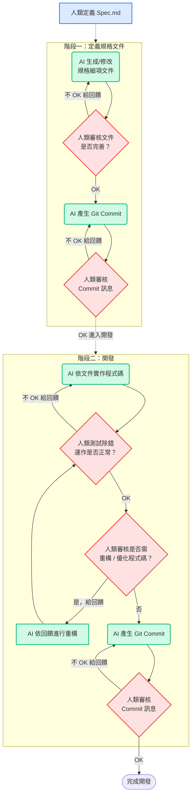

# mangoDB Blog

Hi，這裡是 **mangoDB Blog** (https://su-ya.github.io/mango-db)。

Blog 技術組合是 Next.js + HackMD，
嘗試實驗 AI + Spec-Driven Dev (SDD) 的開發流程。

**開發流程**

1. 定義原始文件 (Spec)：由人在 `.openspec/Spec.md` 中列出網站的核心需求、功能規劃與預期技術組合。

2. 展開技術文件 (Docs)：AI 基於 `Spec.md`，進一步生成細項文件：`.openspec/DevGuide.md`, `DataSpec.md`, `ComponentSpec.md`, `Tasks.md`。由人逐一審核詳確保文件設計完善。

    詳細規格文件在 `.openspec/` 目錄下：
    ├── .openspec/                  # 專案規格文件
    │   ├── Spec.md                 # 原始文件
    │   ├── DataSpec.md             # 文章資料結構與 HackMD API
    │   ├── ComponentSpec.md        # UI 元件與 Page 頁面規格
    │   ├── DevGuide.md             # 開發部署 Workflow 與環境指南
    │   ├── DevLog.md               # 開發日誌與決策備忘錄
    │   └── Tasks.md                # 專案任務與進度追蹤
    註：DevLog.md 是開發階段產生的

3. 實作程式碼 (Code)：AI 依據詳細文件來建立專案環境、實作功能元件並生成 Git Commits。由人來 Code Revie、測試除錯，與 AI 討論架構重構與踩雷解法。

想知道詳細效果跟踩雷請看 Blog 系列文【用 AI 加速開發：20 天打造輕量版 Blog】。